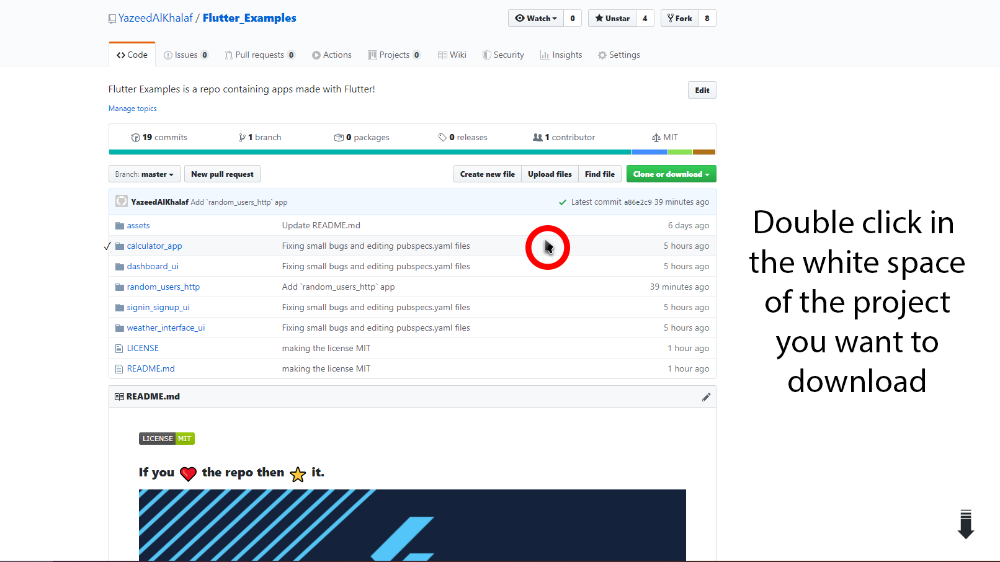
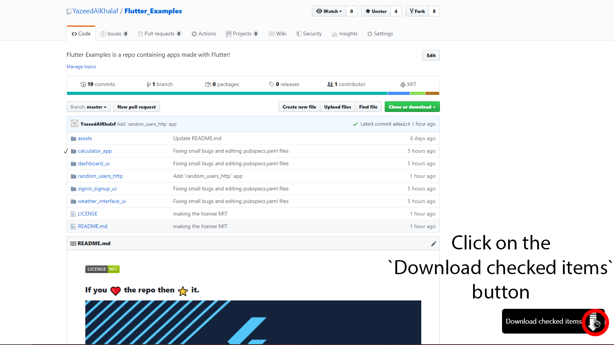

### If you :heart: the repo then :star: it.

# Flutter Examples

Apps made using [Flutter](https://flutter.dev)

# How to use OR download?

### Way One (Recommended)

1. Download [GitZip for GitHub](https://chrome.google.com/webstore/detail/gitzip-for-github/ffabmkklhbepgcgfonabamgnfafbdlkn) from Google Chrome Webstore.
2. Double click on the white space beside the project you want to download as shown in the picture below:
   
3. Click on the `Download checked items` button as shown in the picture below
   

### Way Two

1. You can clone this repo or download it as a zip.
2. Have Fun Playing Around!

## Will you update this repo?

> Definitely yes, I will update this repo.
> There will be more apps to make use of in the future.

## Flutter Example Apps (Source Code)

1.  [Sign In & Sign Up UI](https://github.com/YazeedAlKhalaf/Flutter_Examples/tree/master/examples/signin_signup_ui)

2.  [Weather Interface UI](https://github.com/YazeedAlKhalaf/Flutter_Examples/tree/master/examples/weather_interface_ui)

3.  [Calculator App (IOS Replica)](https://github.com/YazeedAlKhalaf/Flutter_Examples/tree/master/examples/calculator_app)

4.  [Dashboard UI](https://github.com/YazeedAlKhalaf/Flutter_UI/tree/master/examples/dashboard_ui)

5.  [Random Users HTTP](https://github.com/YazeedAlKhalaf/Flutter_Examples/tree/master/examples/random_users_http)

6.  [Crypto Info](https://github.com/YazeedAlKhalaf/Flutter_Examples/tree/master/examples/crypto_info)

## Want to contribute?

Make a new pull request!

> There will be more specific `rules and guidelines` in the FUTURE!

## License

This project is licensed under MIT License, So please consider supproting me by ⭐!
