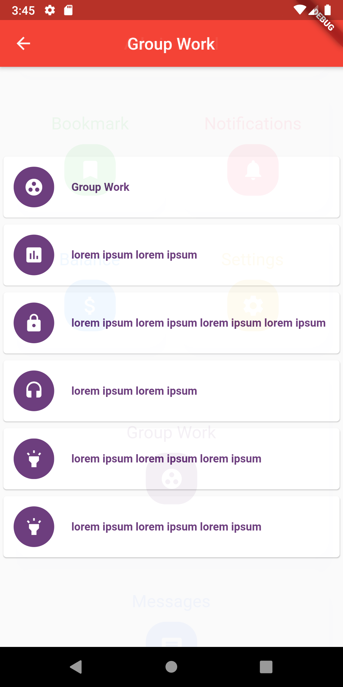

# Dashboard UI

A Dashboard UI app made with Flutter. It is open-source.

## There Is A Video Explaining It

Link to the YouTube video on how to make the Dashboard from ZERO to HERO!

Link: Not uploaded!

## Some Screenshots

